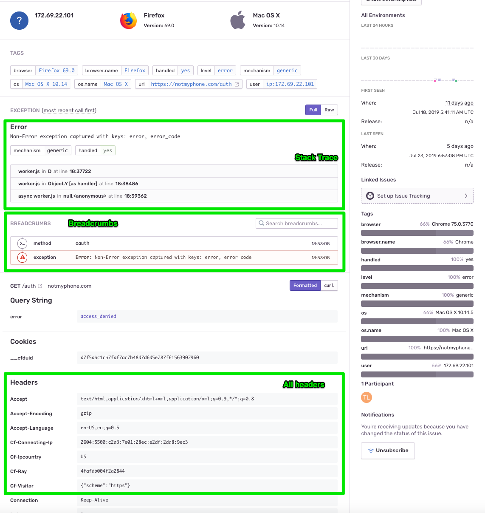

## Sentry Client for Cloudflare Workers

This client attempts to adhere to the [Sentry SDK Guidelines](https://docs.sentry.io/development/sdk-dev/)
and works inside a [Cloudflare Workers](https://workers.cloudflare.com/) environment.

#### Usage
1. Install it: `npm install --save tlianza/pigeon`
2. Initialize the client in your worker
    ```es6
    import * as Pigeon from "pigeon";
    
    // Your cloudflare worker starts here
    addEventListener("fetch", event => {
      // Initialize the client with your DSN & current event
      Pigeon.init({
        dsn: "YOUR_DSN",
        event: event
      });
    
      // Make sure this is on.
      event.passThroughOnException();
      
      //Rest of your logic/routing/etc here.
    });
    ```
3. Use it within your code like this:
    ```es6
    Pigeon.captureMessage("Test Message");
    
    Pigeon.captureException(new Error("TEST Error"));
    
    Pigeon.addBreadcrumb({
        category: 'method',
        message: 'Method "testmethod" was called',
        level: Severity.Info
    });
    ```

#### What do you get in Sentry?
You should see all of the expected request info. Stack traces 
should be present but line numbers will be a little sad
if your code is webpacked/[wrangled](https://github.com/cloudflare/wrangler) up.
Still, you'll get the appropriate column numbers.



This is a real example from debugging the "[not my phone](https://lianza.org/blog/2019/07/19/i-wanted-to-stop-sleeping-next-to-my-phone/)" app.

#### Why is it called Pigeon?
It seemed like the Sentry clients were all named after birds (Raven, etc) and a Pigeon is a "worker bird".
